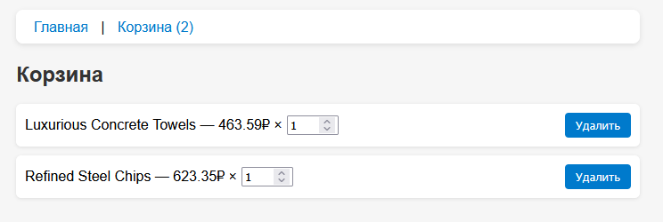

# README - Лабораторная работа №6

## Тема: Разработка интернет-магазина с использованием Redux Toolkit

### Цель работы:

Научиться использовать библиотеку Redux Toolkit для управления глобальным состоянием в React-приложении, а также реализовать функциональность добавления и удаления товаров из корзины, изменение их количества, взаимодействие с REST API и сохранение данных в `localStorage`.

---

## Структура проекта:

```
src/
├── App.jsx                      # Основной компонент приложения с маршрутизацией
├── main.jsx                     # Точка входа, подключение Redux и рендера
├── components/                  # Повторно используемые компоненты
│   ├── Header.jsx
│   ├── CartPage.jsx
│   └── ProductForm.jsx
│   └── ProductList.jsx
├── pages/
│   └── Home.jsx                 # Главная страница с формой и списком товаров
├── store/
│   ├── store.js                 # Создание Redux store
│   └── cart/
│       ├── slice.js             # Redux slice корзины: действия и редукторы
│       └── actions.js           # Селекторы корзины
├── styles/
│   └── styles.css               # Стилизация интерфейса
```

### Установка и запуск проекта:

1. **Клонировать репозиторий или перейти в директорию проекта**

2. **Установить зависимости**
```sh
npm install
```

3. **Запустить проект**
```sh
npm run dev
```

4. **Открыть в браузере**
Перейдите по адресу, указанному в терминале (обычно http://localhost:5173).

---

## Основной функционал:

### 1. Главная страница:

* Отображает заголовок "Интернет-магазин".
* Включает форму для добавления товара:

  * Валидация на имя и цену.
  * POST-запрос к MockAPI.
* Загружает список товаров с сервера.
* Позволяет добавить товар в корзину кнопкой.

### 2. Корзина:

* Отображает все товары, добавленные в корзину.
* Поддерживает изменение количества товара.
* Позволяет удалить товар.
* Подсчет общего количества товаров через селектор.

### 3. Глобальное состояние с Redux Toolkit:

* Используется `createSlice` для хранения корзины.
* Действия: `addToCart`, `removeFromCart`, `updateQuantity`, `clearCart`.
* Селекторы: `selectCart`, `selectCartItemsCount`.

### 4. Сохранение корзины:

* Используется `localStorage` для сохранения и восстановления корзины между перезагрузками.
* Функция `persistCart(store)` подписана на изменения Redux-состояния.

### 5. UI и маршрутизация:

* Используется `react-router-dom` для маршрутов `/` и `/cart`.
* Скелетон-загрузка при ожидании данных (`react-loading-skeleton`).
* Общий `Header` с навигацией и индикатором количества товаров.

---

## Используемые технологии:

* React
* Redux Toolkit
* React Redux
* React Router DOM
* Axios
* React Loading Skeleton
* localStorage

---

## Скриншот интерфейса:



---

## Вывод:

В рамках лабораторной работы был реализован интернет-магазин с полной поддержкой корзины. Работа позволила закрепить навыки работы с Redux Toolkit, REST API и хранением данных на клиенте. Полученный опыт полезен для создания масштабируемых React-приложений с глобальным состоянием.
